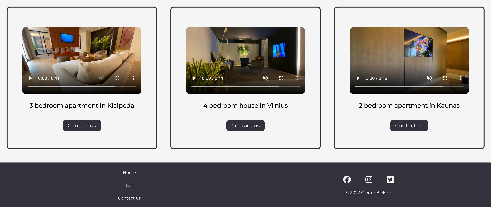
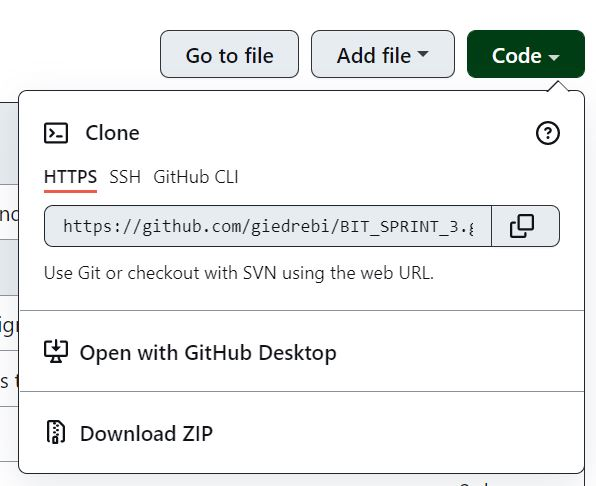
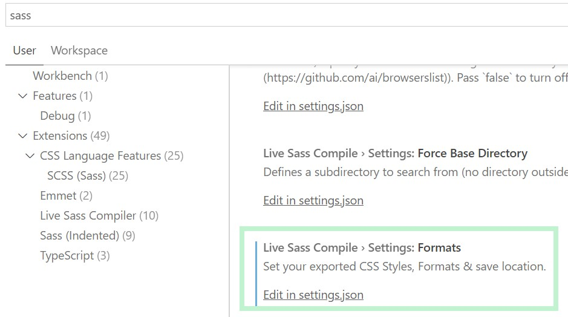
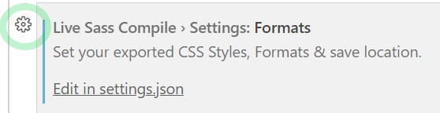
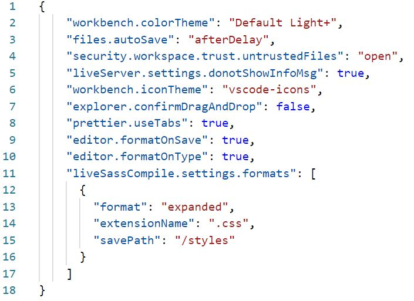
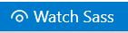

# BIT_SPRINT_3

Project was created for learning purposes. It's a promotional page for a real estate company.

### About project

* Website include 3 pages:
  - Home 
  - List of items 
  - Contact

* Made with HTML and SASS.

* Have two branches:
  - **main**  (this is basic version of website)
  - **premium-branch** (this is moderate version with logo animation and video)

### How to instal
1. First you need to clone repository. Copy link of repository here:

2. Go to the folder where you want clone repository, then open GIT BASH there. 
3. Type `git clone`, then paste the URL you copied earlier and press Enter to create your local clone:

`$ git clone https://github.com/giedrebi/BIT_SPRINT_3.git`

4. You need to have extension **Live Sass Compiler v5.3.0** in VScode.

In VScode open settings and in search bar tab sass. Then scroll down and find section **Live Sass Compiler: Settings: Formats** : 

Then chose settings button and press **Copy Setting as JSON**:

In the same section press on **Edit in settings.json**. Then you need to paste code which you copied before like this:

5. As well, you need to have **Live Server** extension in VScode.

6. Open cloned project folder in VScode. 

Then in below line you need to press on `Watch Sass`:

7. To see website, press on `Go Live` in the same line as before:

### Premium-branch

To launch premium branch you need to clone repository with command:

 `$ git clone --single-branch --branch premium-branch https://github.com/giedrebi/BIT_SPRINT_3.git`

Then repeat 6 and 7 steps.

### Author

This project was created by me [Giedre Bielske](https://giedrebi.github.io/)

As well, you can find me in [LinkedIn](https://www.linkedin.com/in/giedr%C4%97-bielsk%C4%97-1a8996107/)
